```mermaid
graph TB
    subgraph "External Actors"
        USER[👤 User/Client]
        RISK[🌐 Risk Central Service]
    end

    subgraph "Infrastructure Layer - Adapters"
        REST[REST Controllers<br/>AffiliateController<br/>CreditApplicationController<br/>AuthController]
        JPA[JPA Repositories<br/>AffiliateJpaAdapter<br/>CreditApplicationJpaAdapter<br/>RiskEvaluationJpaAdapter]
        HTTP[HTTP Client<br/>RiskCentralAdapter]
        SEC[Security<br/>JWT Filter<br/>SecurityConfig]
        ERR[Exception Handling<br/>GlobalExceptionHandler]
    end

    subgraph "Application Layer - Use Cases"
        UC1[Register Affiliate]
        UC2[Register Credit Application]
        UC3[Evaluate Credit Application]
        UC4[List Applications]
        UC5[Authenticate User]
    end

    subgraph "Domain Layer - Pure Business Logic"
        subgraph "Ports In - Input"
            PIN1[RegisterAffiliateUseCase]
            PIN2[RegisterCreditApplicationUseCase]
            PIN3[EvaluateCreditApplicationUseCase]
            PIN4[ListCreditApplicationsUseCase]
            PIN5[AuthenticateUserUseCase]
        end

        subgraph "Domain Models"
            M1[Affiliate]
            M2[CreditApplication]
            M3[RiskEvaluation]
            M4[User]
        end

        subgraph "Ports Out - Output"
            POUT1[AffiliateRepositoryPort]
            POUT2[CreditApplicationRepositoryPort]
            POUT3[RiskEvaluationRepositoryPort]
            POUT4[RiskEvaluationServicePort]
            POUT5[UserRepositoryPort]
        end

        subgraph "Business Rules"
            BR1[Validation Rules]
            BR2[Credit Policies]
            BR3[Risk Assessment]
        end
    end

    subgraph "Database"
        DB[(MySQL<br/>Database)]
    end

    %% External connections
    USER -->|HTTP/JSON| REST
    HTTP -->|HTTP Request| RISK

    %% Infrastructure to Application
    REST -->|DTO| UC1
    REST -->|DTO| UC2
    REST -->|DTO| UC3
    REST -->|DTO| UC4
    REST -->|DTO| UC5

    %% Application to Domain Ports
    UC1 -.implements.-> PIN1
    UC2 -.implements.-> PIN2
    UC3 -.implements.-> PIN3
    UC4 -.implements.-> PIN4
    UC5 -.implements.-> PIN5

    %% Use Cases use Domain Models
    UC1 -->|uses| M1
    UC2 -->|uses| M2
    UC2 -->|uses| M3
    UC3 -->|uses| M2
    UC3 -->|uses| M3
    UC5 -->|uses| M4

    %% Use Cases use Business Rules
    UC1 --> BR1
    UC2 --> BR1
    UC2 --> BR2
    UC3 --> BR3

    %% Use Cases depend on Output Ports
    UC1 -->|depends on| POUT1
    UC2 -->|depends on| POUT1
    UC2 -->|depends on| POUT2
    UC2 -->|depends on| POUT3
    UC2 -->|depends on| POUT4
    UC3 -->|depends on| POUT2
    UC3 -->|depends on| POUT4
    UC4 -->|depends on| POUT2
    UC5 -->|depends on| POUT5

    %% Adapters implement Output Ports
    JPA -.implements.-> POUT1
    JPA -.implements.-> POUT2
    JPA -.implements.-> POUT3
    JPA -.implements.-> POUT5
    HTTP -.implements.-> POUT4

    %% Infrastructure to Database
    JPA -->|SQL| DB

    %% Security & Error Handling
    SEC -->|protects| REST
    ERR -->|handles| REST

    style USER fill:#e1f5ff
    style RISK fill:#e1f5ff
    style REST fill:#ffe1e1
    style JPA fill:#ffe1e1
    style HTTP fill:#ffe1e1
    style SEC fill:#ffe1e1
    style ERR fill:#ffe1e1
    style UC1 fill:#fff4e1
    style UC2 fill:#fff4e1
    style UC3 fill:#fff4e1
    style UC4 fill:#fff4e1
    style UC5 fill:#fff4e1
    style M1 fill:#e1ffe1
    style M2 fill:#e1ffe1
    style M3 fill:#e1ffe1
    style M4 fill:#e1ffe1
    style PIN1 fill:#f0e1ff
    style PIN2 fill:#f0e1ff
    style PIN3 fill:#f0e1ff
    style PIN4 fill:#f0e1ff
    style PIN5 fill:#f0e1ff
    style POUT1 fill:#f0e1ff
    style POUT2 fill:#f0e1ff
    style POUT3 fill:#f0e1ff
    style POUT4 fill:#f0e1ff
    style POUT5 fill:#f0e1ff
    style BR1 fill:#ffffcc
    style BR2 fill:#ffffcc
    style BR3 fill:#ffffcc
    style DB fill:#d4d4d4
```

## Key Principles

### 1. Dependency Rule
- **Domain Layer** has NO dependencies on outer layers
- **Application Layer** depends only on Domain
- **Infrastructure Layer** depends on Application and Domain

### 2. Ports & Adapters
- **Input Ports**: Interfaces defining use cases (what the application does)
- **Output Ports**: Interfaces defining external dependencies (what the application needs)
- **Adapters**: Concrete implementations of ports (REST, JPA, HTTP clients)

### 3. Benefits
- ✅ **Testability**: Domain logic can be tested without infrastructure
- ✅ **Flexibility**: Easy to swap adapters (e.g., MySQL → PostgreSQL)
- ✅ **Maintainability**: Clear separation of concerns
- ✅ **Independence**: Business logic isolated from frameworks
