```mermaid
graph TB
    subgraph "Client Applications"
        WEB[🌐 Web Client<br/>Browser/Postman]
        MOBILE[📱 Mobile App<br/>Future]
    end

    subgraph "CoopCredit System"
        subgraph "credit-application-service:8080"
            API[REST API<br/>Spring Boot]
            AUTH[JWT Security<br/>Authentication]
            BL[Business Logic<br/>Use Cases]
            CACHE[Cache Layer<br/>Future]
        end

        subgraph "risk-central-mock-service:8081"
            RISK_API[Risk API<br/>Spring Boot]
            SCORE[Score Generator<br/>Deterministic]
        end

        subgraph "Database Layer"
            DB[(MySQL:3306<br/>coopcredit_db)]
        end

        subgraph "Observability"
            ACT[Actuator<br/>Health & Metrics]
            PROM[Prometheus<br/>Metrics Export]
            LOGS[Structured Logs<br/>JSON Format]
        end

        subgraph "API Documentation"
            SWAGGER[Swagger UI<br/>OpenAPI 3.0]
        end
    end

    subgraph "Monitoring & Observability (Future)"
        GRAFANA[📊 Grafana<br/>Dashboards]
        PROM_SERVER[📈 Prometheus<br/>Server]
        ELK[🔍 ELK Stack<br/>Log Aggregation]
    end

    %% Client connections
    WEB -->|HTTPS/JSON| API
    MOBILE -.->|HTTPS/JSON| API

    %% Internal service communication
    API -->|JWT Token| AUTH
    AUTH -->|Validated| BL
    BL -->|JPA/Hibernate| DB
    BL -->|HTTP POST| RISK_API
    RISK_API -->|Risk Score| SCORE
    SCORE -->|Response| BL

    %% Documentation & Monitoring
    WEB -->|Browse| SWAGGER
    API -->|Exposes| ACT
    ACT -->|Metrics| PROM
    BL -->|Writes| LOGS

    %% Future monitoring
    PROM -.->|Scrape| PROM_SERVER
    PROM_SERVER -.->|Visualize| GRAFANA
    LOGS -.->|Ship| ELK

    %% Data flow annotations
    API -.->|"1. Authenticate"| AUTH
    AUTH -.->|"2. Execute Use Case"| BL
    BL -.->|"3. Evaluate Risk"| RISK_API
    RISK_API -.->|"4. Return Score"| BL
    BL -.->|"5. Persist Data"| DB
    DB -.->|"6. Return Result"| API

    style WEB fill:#e1f5ff
    style MOBILE fill:#e1f5ff
    style API fill:#ffe1e1
    style AUTH fill:#fff4e1
    style BL fill:#e1ffe1
    style CACHE fill:#f0e1ff
    style RISK_API fill:#ffd4d4
    style SCORE fill:#ffd4d4
    style DB fill:#d4d4d4
    style ACT fill:#ffffcc
    style PROM fill:#ffffcc
    style LOGS fill:#ffffcc
    style SWAGGER fill:#e1f5ff
    style GRAFANA fill:#e0e0e0
    style PROM_SERVER fill:#e0e0e0
    style ELK fill:#e0e0e0
```

## Service Communication

### 1. credit-application-service (Port 8080)

**Responsibilities:**
- User authentication & authorization (JWT)
- Affiliate management (CRUD)
- Credit application management
- Business rule validation
- Risk evaluation orchestration
- Data persistence

**Technology Stack:**
- Java 21
- Spring Boot 3.5.0
- Spring Security + JWT
- Spring Data JPA
- Hibernate
- MySQL Driver
- Flyway (migrations)
- MapStruct (mapping)
- Actuator (monitoring)

**Key Endpoints:**
- `POST /api/auth/login` - Authentication
- `POST /api/auth/register` - User registration
- `POST /api/affiliates` - Create affiliate
- `GET /api/affiliates/{id}` - Get affiliate
- `POST /api/credit-applications` - Create application
- `GET /api/credit-applications` - List applications
- `PUT /api/credit-applications/{id}/status` - Update status

**Observability:**
- `/actuator/health` - Health check
- `/actuator/metrics` - Application metrics
- `/actuator/prometheus` - Prometheus metrics
- `/swagger-ui.html` - API documentation

---

### 2. risk-central-mock-service (Port 8081)

**Responsibilities:**
- Simulate external credit risk evaluation
- Generate deterministic risk scores
- Classify risk levels
- Provide evaluation recommendations

**Technology Stack:**
- Java 21
- Spring Boot 3.5.0
- Minimal dependencies (no database)

**Key Endpoint:**
- `POST /api/risk-evaluation` - Evaluate credit risk

**Request:**
```json
{
  "documentNumber": "1234567890",
  "requestedAmount": 10000000,
  "termMonths": 24
}
```

**Response:**
```json
{
  "documentNumber": "1234567890",
  "riskScore": 750,
  "riskLevel": "LOW",
  "evaluationDate": "2025-12-09T13:46:00",
  "externalReference": "RSK-A1B2C3D4",
  "recommendation": "Approved for credit."
}
```

**Score Generation:**
- **Range**: 300-950 (deterministic based on document hash)
- **Classification**:
  - < 300: CRITICAL
  - 300-500: HIGH
  - 501-700: MEDIUM
  - 701+: LOW

---

### 3. MySQL Database (Port 3306)

**Database:** `coopcredit_db`

**Tables:**
- `affiliates` - Affiliate information
- `users` - System users (authentication)
- `credit_applications` - Credit applications
- `risk_evaluations` - Risk assessment results

**Migrations:**
- V1: Schema creation
- V2: Relationships and constraints
- V3: Initial data (admin, analyst users)

---

## Communication Flows

### Flow 1: Create Credit Application

```
Client → credit-application-service
  ↓
1. Validate JWT token
  ↓
2. Validate affiliate (active, seniority ≥ 6 months)
  ↓
3. Validate business rules (amount, term, debt ratio)
  ↓
4. Calculate financials (monthly quota, debt-to-income)
  ↓
5. Call risk-central-mock-service
  ↓
risk-central-mock-service
  ↓
6. Generate deterministic score
  ↓
7. Classify risk level
  ↓
8. Return risk evaluation
  ↓
credit-application-service
  ↓
9. Apply risk rules (approve/reject/review)
  ↓
10. Persist application + risk evaluation (transactional)
  ↓
11. Return result to client
```

### Flow 2: Authentication

```
Client → POST /api/auth/login
  ↓
1. Validate credentials (username/password)
  ↓
2. Check password hash (BCrypt)
  ↓
3. Generate JWT token (24h expiration)
  ↓
4. Return token + user info
  ↓
Client stores token
  ↓
Subsequent requests include: Authorization: Bearer {token}
```

---

## Deployment Architecture

### Docker Compose

```yaml
services:
  mysql:
    - Port: 3306
    - Volume: mysql-data
    - Health check enabled

  risk-central-mock:
    - Port: 8081
    - Depends on: none
    - Health check: /actuator/health

  credit-application-service:
    - Port: 8080
    - Depends on: mysql, risk-central-mock
    - Environment: DB connection, JWT secret
```

### Network

All services communicate via `coopcredit-network` (bridge driver)

---

## Scalability Considerations

### Current State (MVP)
- Single instance of each service
- Single MySQL instance
- No load balancing

### Future Enhancements
1. **Horizontal Scaling**
   - Multiple instances behind load balancer
   - Stateless JWT authentication enables scaling

2. **Database**
   - Read replicas for queries
   - Connection pooling optimization

3. **Caching**
   - Redis for session data
   - Cache affiliate data

4. **API Gateway**
   - Kong or Spring Cloud Gateway
   - Rate limiting
   - Request routing

5. **Message Queue**
   - RabbitMQ/Kafka for async processing
   - Decouple risk evaluation

6. **Monitoring**
   - Prometheus + Grafana
   - ELK Stack for logs
   - Distributed tracing (Zipkin/Jaeger)
