```mermaid
graph TB
    subgraph "Actors"
        AFILIADO[👤 Afiliado<br/>Affiliate]
        ANALISTA[👨‍💼 Analista<br/>Credit Analyst]
        ADMIN[👨‍💻 Administrador<br/>System Admin]
    end

    subgraph "Authentication & Authorization"
        UC_REG[Register User<br/>POST /api/auth/register]
        UC_LOGIN[Login<br/>POST /api/auth/login]
    end

    subgraph "Affiliate Management"
        UC_CREATE_AFF[Register Affiliate<br/>POST /api/affiliates]
        UC_VIEW_AFF[View Affiliate<br/>GET /api/affiliates/:id]
        UC_LIST_AFF[List Affiliates<br/>GET /api/affiliates]
        UC_UPDATE_AFF[Update Affiliate<br/>PUT /api/affiliates/:id]
    end

    subgraph "Credit Application Management"
        UC_CREATE_APP[Create Credit Application<br/>POST /api/credit-applications]
        UC_VIEW_APP[View Application<br/>GET /api/credit-applications/:id]
        UC_LIST_APP[List Applications<br/>GET /api/credit-applications]
        UC_EVAL_APP[Evaluate Application<br/>POST /api/credit-applications/:id/evaluate]
        UC_UPDATE_STATUS[Update Status<br/>PUT /api/credit-applications/:id/status]
    end

    subgraph "External Services"
        EXT_RISK[Risk Central Service<br/>Evaluate Credit Risk]
    end

    %% Authentication
    AFILIADO --> UC_REG
    AFILIADO --> UC_LOGIN
    ANALISTA --> UC_LOGIN
    ADMIN --> UC_LOGIN

    %% Affiliate Management
    ADMIN --> UC_CREATE_AFF
    ADMIN --> UC_VIEW_AFF
    ADMIN --> UC_LIST_AFF
    ADMIN --> UC_UPDATE_AFF
    ANALISTA --> UC_VIEW_AFF
    ANALISTA --> UC_LIST_AFF

    %% Credit Applications - Afiliado
    AFILIADO --> UC_CREATE_APP
    AFILIADO --> UC_VIEW_APP

    %% Credit Applications - Analista
    ANALISTA --> UC_LIST_APP
    ANALISTA --> UC_VIEW_APP
    ANALISTA --> UC_EVAL_APP
    ANALISTA --> UC_UPDATE_STATUS

    %% Credit Applications - Admin
    ADMIN --> UC_CREATE_APP
    ADMIN --> UC_LIST_APP
    ADMIN --> UC_VIEW_APP
    ADMIN --> UC_EVAL_APP
    ADMIN --> UC_UPDATE_STATUS

    %% External Integration
    UC_CREATE_APP -.->|integrates| EXT_RISK
    UC_EVAL_APP -.->|integrates| EXT_RISK

    %% Relationships
    UC_CREATE_APP -->|requires| UC_VIEW_AFF
    UC_EVAL_APP -->|updates| UC_VIEW_APP

    style AFILIADO fill:#e1f5ff
    style ANALISTA fill:#ffe1e1
    style ADMIN fill:#fff4e1
    style UC_REG fill:#e1ffe1
    style UC_LOGIN fill:#e1ffe1
    style UC_CREATE_AFF fill:#f0e1ff
    style UC_VIEW_AFF fill:#f0e1ff
    style UC_LIST_AFF fill:#f0e1ff
    style UC_UPDATE_AFF fill:#f0e1ff
    style UC_CREATE_APP fill:#ffffcc
    style UC_VIEW_APP fill:#ffffcc
    style UC_LIST_APP fill:#ffffcc
    style UC_EVAL_APP fill:#ffffcc
    style UC_UPDATE_STATUS fill:#ffffcc
    style EXT_RISK fill:#ffd4d4
```

## Use Case Descriptions

### Authentication & Authorization

#### Register User
- **Actor**: Any user
- **Description**: Create a new user account with role assignment
- **Preconditions**: None
- **Postconditions**: User created with encrypted password

#### Login
- **Actor**: Any registered user
- **Description**: Authenticate and receive JWT token
- **Preconditions**: User must be registered
- **Postconditions**: JWT token issued for subsequent requests

---

### Affiliate Management

#### Register Affiliate
- **Actor**: Admin
- **Description**: Register a new affiliate in the system
- **Validations**:
  - Unique document number
  - Salary > 0
  - Valid contact information
- **Postconditions**: Affiliate created with ACTIVE status

#### View Affiliate
- **Actor**: Admin, Analista
- **Description**: View detailed affiliate information
- **Preconditions**: Affiliate must exist
- **Postconditions**: Affiliate data displayed

#### List Affiliates
- **Actor**: Admin, Analista
- **Description**: View paginated list of all affiliates
- **Postconditions**: List of affiliates returned

#### Update Affiliate
- **Actor**: Admin
- **Description**: Update affiliate information
- **Validations**: Same as registration
- **Postconditions**: Affiliate data updated

---

### Credit Application Management

#### Create Credit Application
- **Actor**: Afiliado, Admin
- **Description**: Submit a new credit application
- **Validations**:
  - Affiliate must be ACTIVE
  - Seniority ≥ 6 months
  - Amount ≤ 10x monthly salary
  - Term between 6-60 months
  - Debt-to-income ratio ≤ 40%
- **Integration**: Calls Risk Central Service
- **Postconditions**: Application created with risk evaluation

#### View Application
- **Actor**: Afiliado (own), Analista, Admin
- **Description**: View credit application details
- **Preconditions**: Application must exist
- **Access Control**: Afiliado can only view own applications
- **Postconditions**: Application data displayed

#### List Applications
- **Actor**: Analista (PENDING only), Admin (all)
- **Description**: View list of credit applications
- **Filters**: Status, affiliate, date range
- **Postconditions**: Filtered list returned

#### Evaluate Application
- **Actor**: Analista, Admin
- **Description**: Manually evaluate and decide on application
- **Preconditions**: Application in PENDING or IN_REVIEW status
- **Integration**: May re-evaluate with Risk Central
- **Postconditions**: Application status updated (APPROVED/REJECTED)

#### Update Status
- **Actor**: Analista, Admin
- **Description**: Change application status
- **Validations**: Valid status transitions
- **Postconditions**: Status updated with audit trail

---

## Access Control Matrix

| Use Case | Afiliado | Analista | Admin |
|----------|----------|----------|-------|
| Register User | ✅ | ✅ | ✅ |
| Login | ✅ | ✅ | ✅ |
| Register Affiliate | ❌ | ❌ | ✅ |
| View Affiliate | ❌ | ✅ | ✅ |
| List Affiliates | ❌ | ✅ | ✅ |
| Update Affiliate | ❌ | ❌ | ✅ |
| Create Application | ✅ (self) | ❌ | ✅ |
| View Application | ✅ (own) | ✅ | ✅ |
| List Applications | ✅ (own) | ✅ (PENDING) | ✅ (all) |
| Evaluate Application | ❌ | ✅ | ✅ |
| Update Status | ❌ | ✅ | ✅ |
